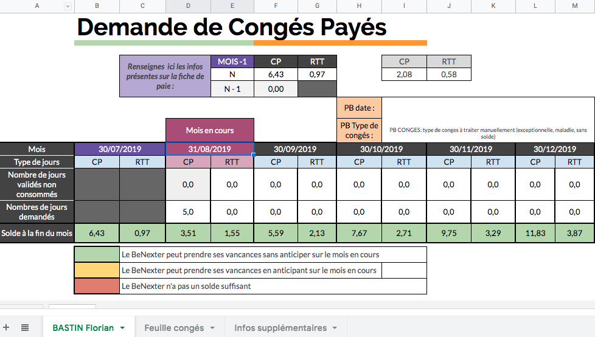

# BoondManager-Auto-Holidays-Validation

This repository allows you to automate the holidays request from your employees having : 

- 2.08 CP per month   
- 0.58 RTT per month   

It can be used by the human ressources of any company generating its payslip from BoondManager.  
This repository contains an executable button, such that any human ressources employee can use it once it is downloaded.  
It produces a google drive spreadhsheet with one worksheet per employee with the details of the computations and allows the human ressources to accelerate their process of holiday requests.  

Example of output :  

## Getting Started

These instructions will get you a copy of the project up and running on your local machine for development and testing purposes. See deployment for notes on how to deploy the project on a live system. 

### Prerequisites

pip > 2.9  
python > 2.7  
virtualenv  

### Installing

1. You first need to create a key and save it in the "client_secret.json" file   
Very nice explanation to create a secret key from GCP here
https://www.twilio.com/blog/2017/02/an-easy-way-to-read-and-write-to-a-google-spreadsheet-in-python.html

2. Import the example_output.xslx file on your google drive and follow the steps of 1., specify the id_sheet in RENSEIGNEZ_MOI.txt by the id of the spreadsheet

3. Create à directory Data. Get the pdf payslip of the empoloyees and save it as "Paies" in the Data directory

4. Get the csv. file of holidays request from employees "absences_en_attente_de_validation.csv" and the file of holidays acceptances "absences_validees.csv" in the Data directory.   
These files are uploaded from BoonManager (option utf-8, detailed)   (help : https://support.boondmanager.com/hc/fr/articles/205743519-G%C3%A9rer-les-demandes-d-absences)

5. If the name of the files are differents from the one written in 1., 2. & 3., configure their names in RENSEIGNEZ_MOI.txt

6. In the LANCER_MOI.command, change the first line by the path of your directory. If it does not work, open the LANCER_MOI.command as a text file and execute each line in the terminal.

7. Launch the code by clicking LANCER_MOI.command button
  
## Authors

* **Florian Bastin** - www.linkedin.com/in/florian-bastin-08940b131 - https://github.com/BastinFlorian

## License

This project is licensed under the MIT License - see the LICENSE.md file for details.

## Acknowledgments

* Check the RENSEIGNEZ_MOI.txt file for more informations
* For Boond Manager users only
* The pdf extraction may differ from one company to another
